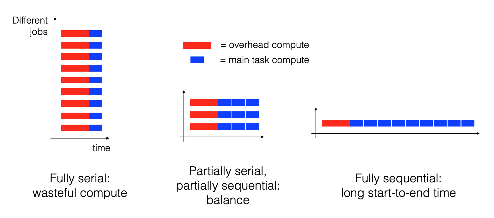
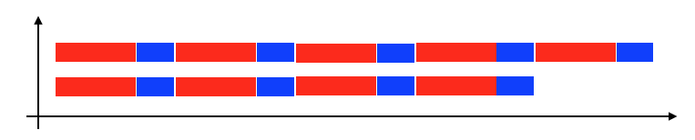

# A simple example of changing an R-code for loop into parallelised command-line executions

A computational problem that is 'embarassingly parallelisable' is one that can be broken up into parts that can be executed with no dependency on each other, such that they can be executed in parallel (serially) instead of one after the other (sequentially).
Here I'll show an example of doing that for an R-code for loop.

First, here is some toy R code that sequentially applies the same processing to each of a number of different inputs, using a for loop:
```r
library(tidyverse)

# Dummy example of processing a list of params
process_parameters <- function(list_of_params) {
  list(sum=sum(list_of_params), product=prod(list_of_params))
}

# Generate all combinations of different values
# (i.e. take the outer product) for three params 
df_params <- expand_grid(x = 1:3, y = 4:6 * 10, z = 100)

# Process each set of params serially
for (row_number in 1:nrow(df_params)) {
  params <- df_params[row_number, ]
  result <- process_parameters(params)
  # Do something with that result, e.g. print it
  print(params)
  print(result)
}

# Or if you want to collect all the results together, this also works sequentially
df_results <- map(1:nrow(df_params), function(row_number) {
  params <- df_params[row_number, ]
  result <- process_parameters(params)
  bind_cols(as_tibble(params), as_tibble(result))
}) %>%
  bind_rows()
```

Now say we want to parallelise that processing of each set of parameters, controlled by the command line, suitable for submission to a computational cluster.
First we should create a file from that `df_params` object created above, e.g. using the `write_csv()` function.
Then the following Rscript can be used to process that csv file one line (i.e. one set of parameters) at a time:

```r
#!/usr/bin/env Rscript 
suppressMessages(library(tidyverse))
suppressMessages(library(argparse))

# Set this script up for use from the command line, parsing the arguments
parser <- ArgumentParser()
parser$add_argument("parameter_file",
                    help="csv file with one row per set of parameters")
parser$add_argument("which_line_to_process", type="integer",
                    help=paste("Which line of parameter_file this script",
                    "should process. Specify as a positive integer"))
args <- parser$parse_args()

# Read the parameter file
df_params <- read_csv(args$parameter_file, show_col_types = FALSE)

# Extract the desired line from the parameter file, defining one set of parameters
stopifnot(args$which_line_to_process > 0)
stopifnot(args$which_line_to_process <= nrow(df_params))
params <- df_params[args$which_line_to_process, ]

# Before we spend CPU time, check the output file we'll write to doesn't exist
# already
file_output <- paste0("~/processing_many_parameters_example_output_",
                      paste(names(params), collapse = "_"),
                      "_",
                      paste(params, collapse = "_"),
                      ".csv")
stopifnot(!file.exists(file_output))

# Process the one set of parameters to be considered here
process_parameters <- function(list_of_params) {
  list(sum=sum(list_of_params), product=prod(list_of_params))
}
result <- process_parameters(params)

# Write the results and the input to an output file
df_input_and_output <- bind_cols(as_tibble(params), as_tibble(result))
write_csv(df_input_and_output, file_output)
```
Assuming that code is stored in a file named `process_one_parameter.R`, that this file is in the same directory as your current directory in the command line, that this file has been exectuble e.g. by running `chmod u+x process_one_parameter.R`, and the that dataframe of parameters was saved to a file named `parameters.csv`, you can process the first set of parameters by running from the command line
```shell
process_one_parameter.R parameters.csv 1
```
and the second set of parameters by replacing that `1` by a `2`, etc.

Many computational clusters support a type of job called an array job, in which you specify a set of values for some variable to change through (normally a set of integers from 1 to something), and the job will be run many times, once with each value of that variable.
For example with the slurm job management system, if your job script contains the line
```
#SBATCH --array 1-9
```
Then the content of your job script will be executed 9 times with the variable named `SLURM_ARRAY_TASK_ID` changing through the integer values from 1 to 9.
Each of those sub-jobs - 'elements of the array' - will run independently, either serially, sequentially, or a mix of the two according to how many separate computational nodes you can use at once on your cluster.
Thus if your job script contained `process_one_parameter.R parameters.csv $SLURM_ARRAY_TASK_ID`, each element of the array would process one set of parameters.

Finally, if after running that script to process all your parameter sets you have the results in a set of output files whose paths are like `~/processing_many_parameters_example_output_*`, you can read all of them into a single dataframe like this:
```r
files_csv <- Sys.glob("~/processing_many_parameters_example_output_*")
df <- map(files_csv, ~ read_csv(.x)) %>% 
  bind_rows()
```

### _Partially_ parallelising array jobs

There is always some computational overhead (extra time needed outside of the core task) for each element of the array. 
Part of that comes from the job scheduling process, and part comes from the code getting ready for the core task that is to be parallelised (above, the execution of the `process_parameters` function) such as loading required packages.
If the time needed for the core task is comparable to or less than the overhead, then processing only one such task in each element of the array is a wasteful use of the cluster resources, and you will not be thanked by other users or the cluster managers.
You probably don't want to execute completely sequentially or you would have used your original for loop instead of reading this post.
So what you want in such cases is in between completely serial processing and completely sequential processing: instead of assigning each value of `SLURM_ARRAY_TASK_ID` to _one_ task to process, assign it to _several_ tasks to process, which will collectively pay the price of the overhead only once together instead of once each.
See the diagram below.



Note that if the number of elements in your array exceeds the number of computational nodes you can use at once, the situation doesn't automatically adjust from the left-most case below to the middle one, because the elements are run independently and so each one always pays the overhead price even when one runs after another.
To share the overhead for multiple core tasks, you have to manually implement the middle case - executing multiple core tasks within each element of the array.

What you're optimising here is difficult to define exactly, because you're balancing your use of computational resources with how long you're prepared to wait for it to finish.
As a rule of thumb, if you know the overhead is much less than the core task, don't worry about this at all; otherwise, if you can use at most N computational nodes at once, divide up all your tasks into at most N separate jobs (an array of size N).
That will ensure you avoid the extreme scenario where your core task is much faster than the overhead and you have many tasks.
In that scenario, partially parallelising could reduce your use of compuational resources by orders of magnitudes _and_ make the total waiting smaller, by preventing the overhead price being repeatedly paid on the same computational node by different elements of the array run sequentially, due to a limited availability of nodes.
That's shown in the diagram below with N = 2.


